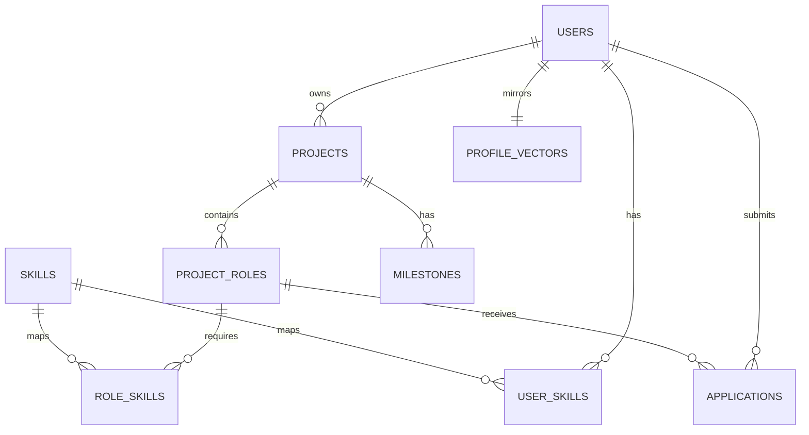

# ER diagram

```mermaid
erDiagram
 USERS ||--o{ PROJECTS : owns
 USERS ||--o{ USER_SKILLS : has
 SKILLS ||--o{ USER_SKILLS : maps
 PROJECTS ||--o{ PROJECT_ROLES : contains
 PROJECT_ROLES ||--o{ ROLE_SKILLS : requires
 SKILLS ||--o{ ROLE_SKILLS : maps
 USERS ||--o{ APPLICATIONS : submits
 PROJECT_ROLES ||--o{ APPLICATIONS : receives
 PROJECTS ||--o{ MILESTONES : has
 USERS ||--|| PROFILE_VECTORS : mirrors
```
